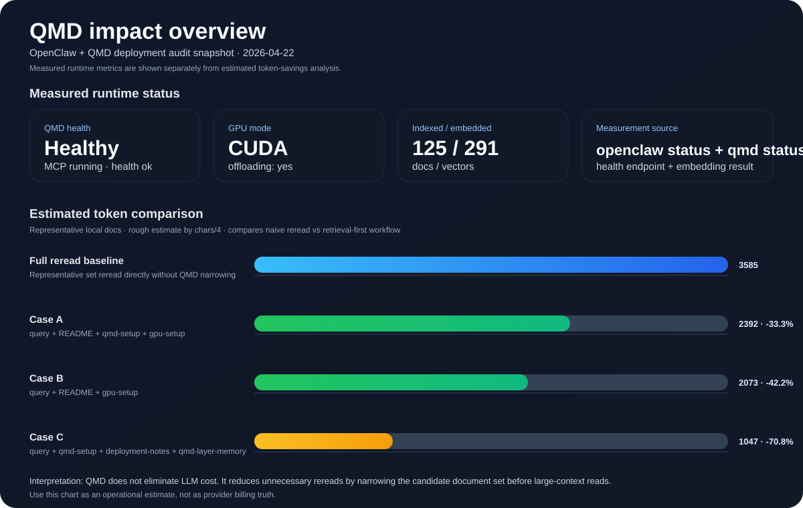

# QMD OpenClaw Kit

[](https://github.com/chf553619-tech/qmd-openclaw-kit/actions/workflows/ci.yml)
[](./LICENSE)
[](https://github.com/tobi/qmd)

**一个可复用的集成套件，用来把 [QMD](https://github.com/tobi/qmd) 变成 OpenClaw 与智能体工作流中的低 token 本地检索层。**

> 简体中文 | [English](./README.md)

## 导航

- [这是什么](#这是什么)
- [为什么要做这个](#为什么要做这个)
- [特性](#特性)
- [快速开始](#快速开始)
- [文档与示例](#文档与示例)
- [发布状态](#发布状态)
- [致谢与归属](#致谢与归属)
- [License](#license)

## 效果总览



### 当前审计快照

| 指标 | 当前结果 |
|---|---|
| OpenClaw gateway | reachable |
| QMD MCP | running |
| QMD health endpoint | ok |
| GPU 模式 | CUDA（`offloading: yes`） |
| 已索引文档 | 125 |
| 已生成向量 | 291 |
| 检索 smoke test | passed |
| 估算 token 节省 | 约 33%–71% |

### 为什么 QMD 有用

| 没有 QMD | 有 QMD |
|---|---|
| 直接重读多个候选 markdown 文件 | 先做本地检索 |
| 常把 README / setup 大文档一起塞进上下文 | 只精读高概率相关文档 |
| 先花 token 找答案在哪 | 先缩小范围，再扩上下文 |
| 上下文很容易越滚越大 | 上下文更聚焦、更可控 |

可进一步阅读：

- 英文审计：[`docs/audit-2026-04-22.md`](./docs/audit-2026-04-22.md)
- 中文审计：[`docs/audit-2026-04-22.zh-CN.md`](./docs/audit-2026-04-22.zh-CN.md)

## 这是什么

QMD OpenClaw Kit 是一个**构建在上游 QMD 之上的轻量集成层**。
它**不会内置、分叉或重新打包 QMD 源码**，而是提供：

- 实用的安装流程
- 面向 WSL / Linux 的更稳妥后端选择包装脚本
- 可重复执行的 collection / context 初始化脚本
- OpenClaw MCP 配置模板
- 适配 OpenClaw 的检索 skill
- 中英双语文档

目标很简单：让 OpenClaw 在读取大量 markdown 之前，先通过本地检索缩小范围，从而降低 token 消耗。

## 为什么要做这个

OpenClaw 这类环境很容易累积大量知识文件：

- 工作区文档
- memory 日志
- 自定义 skills
- 上游产品文档
- 项目说明与运维笔记

如果没有检索层，智能体会不断重复读取大量 markdown。
QMD 本身已经很适合本地检索；这个项目做的是把周边运维胶水补齐。

## 特性

- **尊重上游**：通过 npm 安装 `@tobilu/qmd`
- **面向 OpenClaw**：提供 MCP 与 skill 接入模板
- **后端感知**：优先使用真正可用的 GPU 后端；不满足条件时自动切到稳定 CPU 模式，避免在 WSL 里反复撞坏掉的 Vulkan 自动探测
- **可批量初始化**：一条脚本注册高价值 markdown 目录并附加 context
- **中英双语**：便于公开复用
- **可迁移**：稍作修改即可搬到另一个 OpenClaw 部署里

## 仓库结构

```text
.
├── docs/
├── openclaw-custom-skills/
├── scripts/
└── templates/
```

## 快速开始

### 1）安装 QMD

```bash
./scripts/install-qmd.sh
```

默认会把 `@tobilu/qmd` 安装到当前用户的 npm prefix。

### 2）初始化 collections 与 contexts

```bash
WORKSPACE_ROOT="$HOME/.openclaw/workspace" \
OPENCLAW_HOME="$HOME/.openclaw" \
./scripts/bootstrap-collections.sh
```

脚本会注册常见的 OpenClaw 知识源，例如：

- 工作区根目录 markdown
- workspace memory
- 本地 docs
- OpenClaw 内置 skills / docs
- 自定义 skills
- 可选的 projects 目录

这个 bootstrap 脚本被设计成**可重复安全执行**：

- 已存在的 collections 会复用
- collection contexts 会原位刷新
- 缺失目录会被干净跳过

### 3）把 QMD 接进 OpenClaw MCP

参考：[`templates/openclaw.jsonc`](./templates/openclaw.jsonc)

推荐方式：

- 正常安装 QMD
- 在 OpenClaw 的 MCP 配置里调用 `scripts/start-qmd-mcp.sh`
- 让包装脚本自动选择更稳妥的后端模式

### 4）可选：生成 embeddings

```bash
QMD_LLAMA_GPU=false qmd embed --max-docs-per-batch 12 --max-batch-mb 8
```

在纯 CPU 或 GPU 环境不稳定时会更慢，但通常更可靠。

## GPU / 后端策略

这个项目把后端选择当成**运维问题**，而不是宣传词。

优先级：

1. 优先尊重显式设置的 `QMD_LLAMA_GPU`
2. 检测到真正可用的 CUDA 用户态条件时使用 CUDA
3. 检测到 Vulkan 工具链完整时使用 Vulkan
4. 否则强制回落到 CPU，优先保证稳定性

这样可以避免很多 WSL / 无头环境里常见的问题：自动探测反复尝试一个实际上不可用的 Vulkan 构建路径。

## OpenClaw skill

可复用 skill 位于：

- [`openclaw-custom-skills/qmd-retrieval/SKILL.md`](./openclaw-custom-skills/qmd-retrieval/SKILL.md)

它的原则很简单：

1. 先用 QMD 检索
2. 再精读真正相关的文件
3. 把高 token 的大段重读放到最后

## 文档与示例

### 核心文档

- 架构说明：[`docs/architecture.zh-CN.md`](./docs/architecture.zh-CN.md)
- GPU / 后端说明：[`docs/gpu-setup.zh-CN.md`](./docs/gpu-setup.zh-CN.md)
- CUDA 验证辅助说明：[`docs/check-qmd-cuda.md`](./docs/check-qmd-cuda.md)
- 部署审计（EN）：[`docs/audit-2026-04-22.md`](./docs/audit-2026-04-22.md)
- 部署审计（中文）：[`docs/audit-2026-04-22.zh-CN.md`](./docs/audit-2026-04-22.zh-CN.md)
- Collections 基线：[`docs/collections.md`](./docs/collections.md)
- 发布检查表：[`docs/release-checklist.md`](./docs/release-checklist.md)
- 更新日志：[`CHANGELOG.md`](./CHANGELOG.md)

### 示例

- 最小部署：[`examples/openclaw-minimal`](./examples/openclaw-minimal)
- WSL + NVIDIA 示例：[`examples/openclaw-wsl-gpu`](./examples/openclaw-wsl-gpu)

## 项目卫生

- CI：[`/.github/workflows/ci.yml`](./.github/workflows/ci.yml)
- 贡献说明：[`CONTRIBUTING.md`](./CONTRIBUTING.md)

## 发布状态

这个仓库现在已经进入首个可复用发布阶段。

建议首个版本标签：

- `v0.1.0`

## 致谢与归属

本项目**基于上游 QMD**，作者 / 贡献者为 tobi 等人：

- 上游仓库：<https://github.com/tobi/qmd>

请把本项目看作集成套件，而不是上游文档的替代品。

## License

本集成套件采用 MIT 许可证。

上游 QMD 仍然遵循其自身项目的许可证，本仓库不会对其重新授权。
